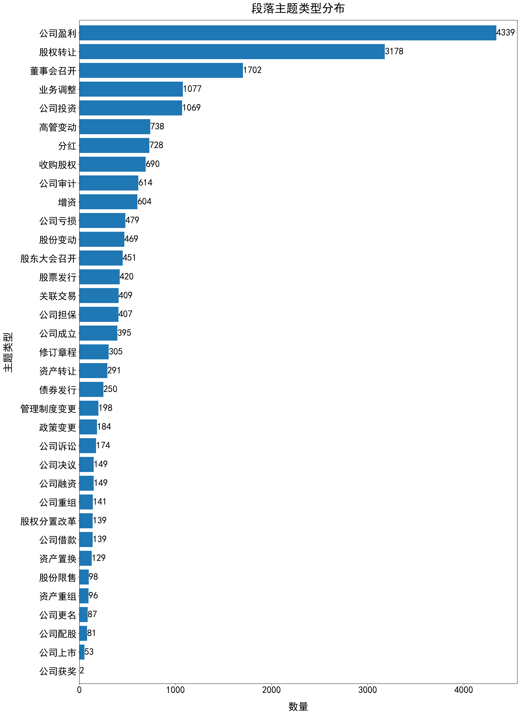

# 金融事件数据集 Fin-ET-Datas
Fin-ET数据集包含了年报文本中提取的金融事件及其时间要素。
## 数据集构建
### 原始数据集来源
- 2010年至2017年期间的8392份企业年报PDF文件，覆盖了300家在上海证券交易所上市的企业。
- AKShare 库来获取相关企业的股票价格变化数据。
### 数据清洗流程
1. 段落级文本构建：基于SentenceBERT方法
   1. 筛选指定章节：“股本变动与股东情况”、“董事会讨论与分析报告”、“重要事项”
3. 提取主题词和时间范围：使用国内大模型如智谱清言、文心一言、通义千问等，通过设计提示词进行相关数据信息的收集，并说明提取理由
   1. 使用公开事件类型数据集微调大模型
   2. 借助哈工大LTP筛选含有时间属性的段落（词性标志nt 或者 语义角色TMP）
   3. 提示词设计以及抽取功能实现
4. 信息人工审查：根据标注的提取理由审核时间范围的准确性
5. 根据公司股票历史价格计算某一事件发生时间范围内的RSI
### 最终数据.json（Data.zip）
数据集最终涵盖了208家上市企业的部分年报内容，包含18,222个段落，总共20,434个段落主题词（少量段落包含多个主题词），每个主题词作为事件都有其对应的发生时间范围，以及大语言模型抽取的依据。 
概括为35种主题类型：公司盈利、股权转让、董事会召开、业务调整、公司投资、高管变动、分红、收购股权、公司审计、增资、公司亏损、股份变动、股东大会召开、股票发行、关联交易、公司担保、公司成立、修订章程、资产转让、债券发行、管理制度变更、政策变更、公司诉讼、公司决议、公司融资、公司重组、股权分置改革、公司借款、资产置换、股份限售、资产重组、公司更名、公司配股、公司上市、公司获奖。
| 属性      | 含义              |
| ----      | ----             |
| Id        | 事件项序号        |
| Report    | 年报来源          |
| Tag       | 所属章节          |
| Input     | 段落级文本正文     |
| Type_Time | 主题词（时间范围） |
| Reason    | 提取原因          |
| RSI       | 股价相对强弱指数   |

Tag的值为“股本变动与股东情况”、“董事会讨论与分析报告”、“重要事项”中的一个。 

Type_Time示例：“公司召开董事会（2003年3月21日-2003年4月26日）” 
### 类型分布图

## IE-System
金融事件信息抽取系统实现及关联图可视化 
使用 flask + html 进行构建，app.py为主程序 
IE-System/Tool中
| 模块                | 功能              |
| ----                | ----              |
| PDF2TXT.py          | PDF转为TXT        |
| Text_Classify       | 段落级文本划分     |
| ZhipuControlAPI.py  | 大模型抽取主要程序 |
| Draw_Pictures.py    | 绘画事件关联图     |

注意：ZhipuControlAPI文件中需要自主提供API_key

